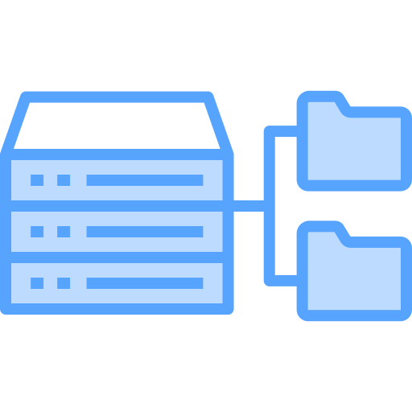

# Estructura De Datos 

> En este `repositorio` se encuentran temas relacionados a las principales `estructuras de datos` realizadas en `java` 

1. Recursividad
2. Arreglos
 - Vectores
 - Matrices
 - Metodos de Busqueda
 - Metodos de Ordenamiento
3. Listas Enlazadas
 - Simples
 - Dobles
 - Circulares
 4. Pilas y Colas
 5. Arboles Binarios
